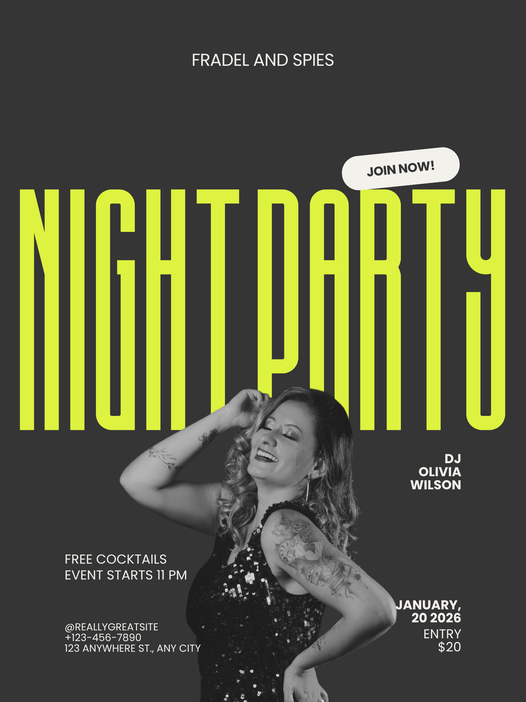

# AI Brand Guardrails

A Next.js prototype that enforces brand compliance **upstream** — at image generation time — before AI-generated images reach the canvas.

The core argument: brand guardrails belong at the moment of creation, not in a downstream approval queue after the fact.



---

## What it does

1. **Extract a Brand Kit** — paste any website URL. The app scrapes the site and takes a screenshot, then uses Claude vision to extract a structured 18-field Brand Kit: colors (with descriptive names), render style, lighting, mood, depth of field, color grade, prohibited elements, and more.

2. **Generate brand-aligned images** — describe what you want in plain language. The app assembles a 7-block structured prompt from your Brand Kit and generates two images via FLUX.1-dev. Three modes adapt enforcement level:
   - **Hero** — full palette, composition, and style enforcement
   - **Supporting** — subject colors stay natural; brand signals apply to environment and atmosphere
   - **B-roll** — texture, mood, and lighting only; palette and composition are flexible

3. **Score against the brand** — each image is automatically evaluated by Claude vision across 6 dimensions: color alignment, render style match, mood & lighting, composition fit, overall cohesion, and a hard prohibited-element override. Scores are weighted by mode.

4. **Iterate with context** — low-scoring images show exactly which dimension failed and why. "Generate alternative" passes the scorer's written diagnosis back into the prompt so the next generation knows specifically what to fix.

5. **Govern placement** — off-brand images require a typed reason before they can be placed on the canvas. The override reason is recorded.

6. **Canvas + export** — drag images and text onto a canvas, resize, reposition, and export as PNG.

---

## Stack

| Layer | Technology |
|---|---|
| Framework | Next.js 14 App Router, React 18, TypeScript |
| Styling | Tailwind CSS + Canva-inspired design tokens |
| State | Zustand |
| Brand extraction | Firecrawl + ScreenshotOne → Claude vision |
| Image generation | FLUX.1-dev via Replicate |
| Brand scoring | Claude vision (6-dimension rubric) |
| Canvas export | html2canvas |
| Deployment | Vercel |

---

## Getting started

### Prerequisites

- Node.js 18+
- API keys for Anthropic, Replicate, Firecrawl, and ScreenshotOne

### Install

```bash
npm install
```

### Environment variables

Copy `.env.example` to `.env.local` and fill in your keys:

```
ANTHROPIC_API_KEY=
REPLICATE_API_TOKEN=
FIRECRAWL_API_KEY=
SCREENSHOTONE_API_KEY=
```

### Run

```bash
npm run dev
```

Open [http://localhost:3000](http://localhost:3000).

---

## Scoring thresholds

| Score | Label |
|---|---|
| ≥ 80 | On-brand |
| 50–79 | Needs review |
| < 50 | Off-brand |

Dimension weights vary by image mode. Hero mode weights color alignment at 30%; b-roll drops it to 10% and elevates mood & lighting to 35%.

A `noProhibited: false` result is a hard override — the image is off-brand regardless of all other dimension scores.

---

## Project structure

```
src/
  app/
    api/
      extract-brand/     # URL → BrandKit JSON
      generate-image/    # prompt + brandKit → images
      score-image/       # imageUrl + brandKit → BrandScore
  components/
    brand-setup/         # Brand Kit extraction and review UI
    canvas/              # Drag-and-drop workspace
    generation/          # Image generator panel + image cards
    scoring/             # Score badge + dimension breakdown tooltip
  lib/
    prompt-builder.ts    # 7-block structured prompt assembly
    brand-extractor.ts   # Claude extraction prompt + parser
    image-scorer.ts      # Claude vision scoring prompt + parser
  store/
    useStore.ts          # Zustand store
  types/
    index.ts             # BrandKit, BrandScore, CanvasElement
```

---

## License

MIT
